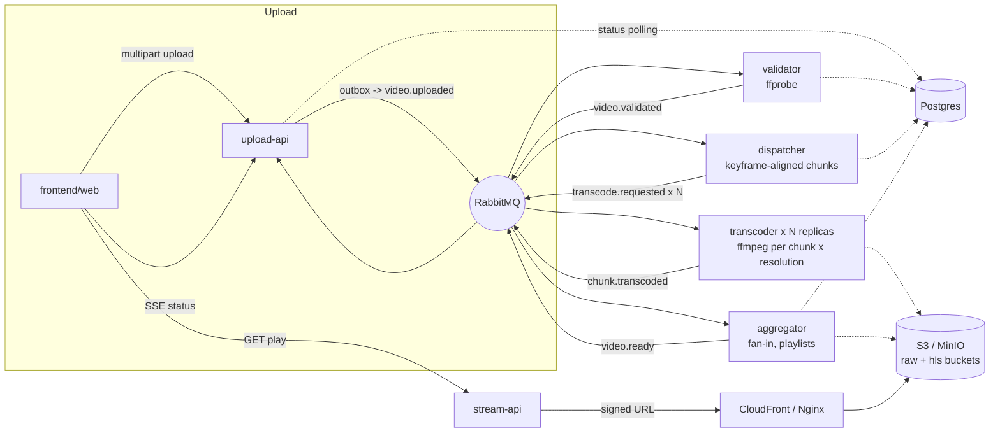

# video-streaming

Upload a video, it gets chunked and transcoded to multiple resolutions in
parallel, and comes out the other side as an HLS stream - built to learn
the pipeline (chunking, fan-out/fan-in, retry/DLQ, idempotency,
distributed tracing, horizontal scaling), not as a product. See
`PLAN.md` for the original phase-by-phase plan this was built from, and
`docs/adrs/` for the reasoning behind the six biggest decisions.

## Architecture



Every arrow into/out of RabbitMQ is one event from
`backend/packages/contracts/src/events/`, versioned and validated with
zod. Every consumer gets its own retry queue (TTL + dead-letter) and DLQ -
see `backend/packages/messaging/src/topology.ts` and ADR 0001.

## Repo layout

```
backend/
  apps/       upload-api, stream-api (NestJS, HTTP) + validator,
              dispatcher, transcoder, aggregator (plain Node workers)
  packages/   contracts, messaging, database, storage, observability,
              config (shared across every app)
frontend/web  Next.js + hls.js
infra/
  docker/     docker-compose for local dev (Postgres, RabbitMQ, MinIO,
              Nginx, Jaeger, Prometheus, Grafana, and all 8 apps)
  terraform/  AWS (sa-east-1 applied, us-east-1 plan-only)
  scale/      autoscaler + chaos scripts (Fase 9)
load-tests/   k6 upload scenario
docs/adrs/    the six ADRs
```

## Running it locally

```bash
pnpm install
cp .env.example .env   # only needed running an app outside docker-compose
docker compose -f infra/docker/docker-compose.yml up -d
```

That brings up Postgres, RabbitMQ, MinIO, Nginx, Jaeger, Prometheus,
Grafana, and all 8 application services. Two one-shot containers
(`migrate`, `minio-init`) run first and exit - Prisma migrations and the
`raw`/`hls` MinIO buckets aren't there on a first boot otherwise - and
every app service waits on both before starting. Once it's up:

| What | Where |
| --- | --- |
| Web app | http://localhost:3003 |
| upload-api (OpenAPI docs at `/docs`) | http://localhost:3001 |
| stream-api (OpenAPI docs at `/docs`) | http://localhost:3002 |
| RabbitMQ management | http://localhost:15672 (streaming/streaming) |
| MinIO console | http://localhost:9001 (streaming/streamingsecret) |
| Jaeger UI | http://localhost:16686 |
| Prometheus | http://localhost:9091 |
| Grafana | http://localhost:3000 (admin/streaming, or anonymous) |

For everyday development (not full-stack docker), run the monorepo's own
tasks instead:

```bash
pnpm run lint
pnpm run test           # unit tests - no Docker needed
pnpm run test:integration   # Testcontainers-backed integration tests - needs Docker
pnpm run typecheck
pnpm run build
```

**`docker compose up` has been run end to end** (Docker wasn't available
when most of this was built - see git history) with a real generated MP4:
upload → `video.uploaded` → validator (real `ffprobe`) → dispatcher
(keyframe-aligned chunks) → transcoder → aggregator → `video.ready`, all
the way to `GET /videos/:id/play` returning a signed URL whose manifest,
sub-playlists and segments all played back through Nginx. That run
surfaced and fixed several bugs no unit test caught: a Prisma engine
built for the wrong OpenSSL version on arm64, `@aws-sdk/client-s3`'s
default checksum behavior breaking every presigned URL, Nginx's 1 MB body
cap and its `$host` variable dropping the port (breaking SigV4
signatures), a `BigInt` field that crashed `JSON.stringify` on the first
real response, and MinIO's Docker Hub images having moved to `quay.io`.

**Known gap, not fixed**: hls.js resolves a sub-resolution playlist and
its `.ts` segments as paths relative to the master `.m3u8` - none of
which carry the master's own presigned query string. `stream-api` only
signs the master, so anything past it 403s unless the bucket allows
anonymous reads. `minio-init` sets `local/hls` to public `download` for
exactly this reason; the same problem exists in the CloudFront path
(`CloudFrontManifestUrlSigner` signs one object too) and isn't fixed
there - Fase 10 needs either a wildcard/custom CloudFront policy or an
authenticated proxy for HLS sub-resources.

Not run in this environment: `pnpm run test:integration` (Testcontainers
pull additional images), the Terraform `plan`/`apply` in
`infra/terraform/`, and the k6/chaos scripts in `load-tests/` and
`infra/scale/`.

## What happens when X fails

- **A transcoder dies mid-job** (`infra/scale/chaos/kill-worker-mid-job.sh`).
  The job's message was never acked, so RabbitMQ redelivers it once the
  connection drops - another replica (or the same one, once restarted)
  picks it up. `processed_events` means even a job that actually finished
  right before the kill won't be double-counted.
- **RabbitMQ restarts** (`infra/scale/chaos/kill-rabbitmq.sh`). validator,
  dispatcher, transcoder and aggregator all reconnect with exponential
  backoff and re-run `assertTopology` + restart their consumer
  (`messaging`'s `connectWithRetry`,
  `backend/packages/messaging/src/resilient-connection.ts`). upload-api
  does not yet do this - see ADR follow-ups / `infra/scale/README.md`'s
  known-gap note.
- **Postgres restarts.** A query against a down Postgres just throws; the
  consumer's normal retry/DLQ path (0001) requeues the message with
  backoff. It only self-heals if the outage is shorter than the retry
  window (~15s with today's defaults) - a longer outage pushes the job to
  the DLQ instead of just delaying it.
- **A chunk fails to transcode 3 times** (bad input, ffmpeg crash, whatever).
  It lands in `transcode.dlq`, untouched, for manual inspection - the video
  stays stuck below `READY` rather than silently missing a resolution.
- **ffprobe can't make sense of an uploaded file.** validator treats that
  as a business outcome, not an infra failure: it publishes
  `video.validation.failed` (no retry - retrying a corrupt file doesn't
  help), and upload-api marks the video `FAILED` with the reason attached.

## Benchmarks

`load-tests/README.md` has the k6 scenario and a benchmark table
template (`--scale transcoder=1,5,10`) - left blank, to fill in from a
real run rather than invented numbers.

## Screenshots / GIF

Not included. The stack now runs end to end (see above) and a video
played back through it in this same environment, but there's no display
here to record a browser against - `docs/adrs/` and this README are the
place to add a GIF of the player and prints of Jaeger/Grafana once someone
runs `docker compose up` with one.

The Grafana dashboard itself (`infra/docker/grafana/provisioning/dashboards/`)
is provisioned and loads automatically with the stack - queue depth,
jobs/s and DLQ rate by service, job duration (p50/p95), and time-to-READY
per video (p50/p95, the metric behind the benchmark table above).
