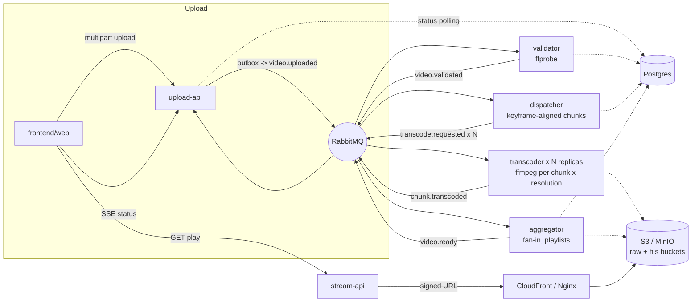

# video-streaming

Upload a video, it gets chunked and transcoded to multiple resolutions in
parallel, and comes out the other side as an HLS stream - built to learn
the pipeline (chunking, fan-out/fan-in, retry/DLQ, idempotency,
distributed tracing, horizontal scaling), not as a product. See
`PLAN.md` for the original phase-by-phase plan this was built from, and
`docs/adrs/` for the reasoning behind the six biggest decisions.

## Architecture



Every arrow into/out of RabbitMQ is one event from
`backend/packages/contracts/src/events/`, versioned and validated with
zod. Every consumer gets its own retry queue (TTL + dead-letter) and DLQ -
see `backend/packages/messaging/src/topology.ts` and ADR 0001.

## Repo layout

```
backend/
  apps/       upload-api, stream-api (NestJS, HTTP) + validator,
              dispatcher, transcoder, aggregator (plain Node workers)
  packages/   contracts, messaging, database, storage, observability,
              config (shared across every app)
frontend/web  Next.js + hls.js
infra/
  docker/     docker-compose for local dev (Postgres, RabbitMQ, MinIO,
              Nginx, Jaeger, Prometheus, Grafana, and all 8 apps)
  terraform/  AWS (sa-east-1 applied, us-east-1 plan-only)
  scale/      autoscaler + chaos scripts (Fase 9)
load-tests/   k6 upload scenario
docs/adrs/    the six ADRs
```

## Running it locally

```bash
pnpm install
cp .env.example .env   # only needed running an app outside docker-compose
docker compose -f infra/docker/docker-compose.yml up -d
```

That brings up Postgres, RabbitMQ, MinIO, Nginx, Jaeger, Prometheus,
Grafana, and all 8 application services. Two one-shot containers
(`migrate`, `minio-init`) run first and exit - Prisma migrations and the
`raw`/`hls` MinIO buckets aren't there on a first boot otherwise - and
every app service waits on both before starting. Once it's up:

| What | Where |
| --- | --- |
| Web app | http://localhost:3003 |
| upload-api (OpenAPI docs at `/docs`) | http://localhost:3001 |
| stream-api (OpenAPI docs at `/docs`) | http://localhost:3002 |
| RabbitMQ management | http://localhost:15672 (streaming/streaming) |
| MinIO console | http://localhost:9001 (streaming/streamingsecret) |
| Jaeger UI | http://localhost:16686 |
| Prometheus | http://localhost:9091 |
| Grafana | http://localhost:3000 (admin/streaming, or anonymous) |

For everyday development (not full-stack docker), run the monorepo's own
tasks instead:

```bash
pnpm run lint
pnpm run test           # unit tests - no Docker needed
pnpm run test:integration   # Testcontainers-backed integration tests - needs Docker
pnpm run typecheck
pnpm run build
```

**Not verified in this repo's own development environment**: the sandbox
this was built in had no Docker daemon at all (not even the `docker` CLI),
so `docker compose up`, `pnpm run test:integration`, the Terraform
`plan`/`apply` in `infra/terraform/`, and the k6/chaos scripts in
`load-tests/` and `infra/scale/` were written and unit-tested in isolation
but never run against a real live stack end to end. Everything under
`pnpm run test` (unit tests, including several against real
`ffmpeg`/`ffprobe` binaries) did run and pass, as did the full
`pnpm run build`.

Two bugs that only show up on a real `docker compose up` were caught by
code review instead of by running it, so treat them as unverified fixes:
`migrate`/`minio-init` (above) depend on Compose's
`service_completed_successfully` condition (Compose v2.20+), and
`S3_PUBLIC_ENDPOINT` assumes Nginx forwards the `Host` header unchanged
(`proxy_set_header Host $host` in `nginx.conf`) so a presigned URL's
signature still matches once MinIO sees it.

## What happens when X fails

- **A transcoder dies mid-job** (`infra/scale/chaos/kill-worker-mid-job.sh`).
  The job's message was never acked, so RabbitMQ redelivers it once the
  connection drops - another replica (or the same one, once restarted)
  picks it up. `processed_events` means even a job that actually finished
  right before the kill won't be double-counted.
- **RabbitMQ restarts** (`infra/scale/chaos/kill-rabbitmq.sh`). validator,
  dispatcher, transcoder and aggregator all reconnect with exponential
  backoff and re-run `assertTopology` + restart their consumer
  (`messaging`'s `connectWithRetry`,
  `backend/packages/messaging/src/resilient-connection.ts`). upload-api
  does not yet do this - see ADR follow-ups / `infra/scale/README.md`'s
  known-gap note.
- **Postgres restarts.** A query against a down Postgres just throws; the
  consumer's normal retry/DLQ path (0001) requeues the message with
  backoff. It only self-heals if the outage is shorter than the retry
  window (~15s with today's defaults) - a longer outage pushes the job to
  the DLQ instead of just delaying it.
- **A chunk fails to transcode 3 times** (bad input, ffmpeg crash, whatever).
  It lands in `transcode.dlq`, untouched, for manual inspection - the video
  stays stuck below `READY` rather than silently missing a resolution.
- **ffprobe can't make sense of an uploaded file.** validator treats that
  as a business outcome, not an infra failure: it publishes
  `video.validation.failed` (no retry - retrying a corrupt file doesn't
  help), and upload-api marks the video `FAILED` with the reason attached.

## Benchmarks

`load-tests/README.md` has the k6 scenario and a benchmark table
template (`--scale transcoder=1,5,10`) - left blank, to fill in from a
real run rather than invented numbers.

## Screenshots / GIF

Not included. Capturing the player in action, or Jaeger/Grafana with real
traces and metrics flowing, needs the stack actually running end to end
with a real video pushed through it - which this environment couldn't do
(no Docker). Once `docker compose up` runs somewhere with a display,
`docs/adrs/` and this README are the place to add them.

The Grafana dashboard itself (`infra/docker/grafana/provisioning/dashboards/`)
is provisioned and loads automatically with the stack - queue depth,
jobs/s and DLQ rate by service, job duration (p50/p95), and time-to-READY
per video (p50/p95, the metric behind the benchmark table above). What's
missing is a screenshot of it with real traffic flowing, for the same
no-Docker reason as the rest of this section.
